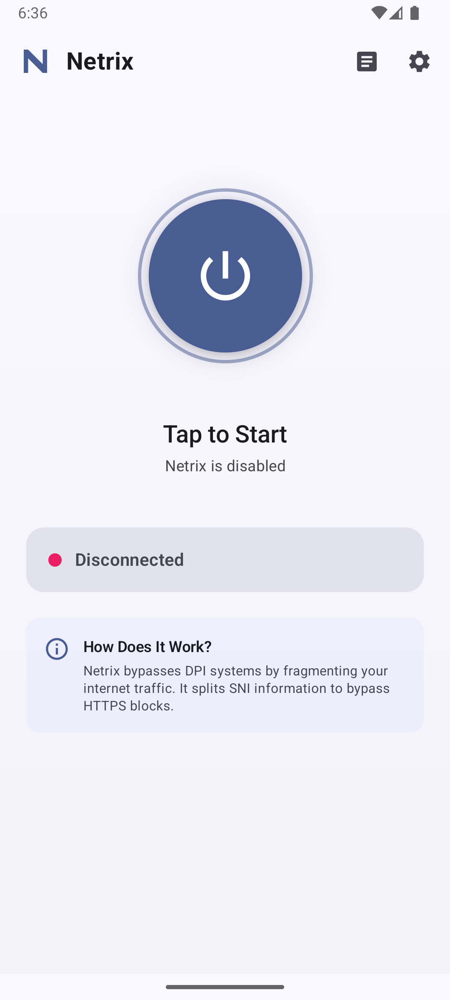
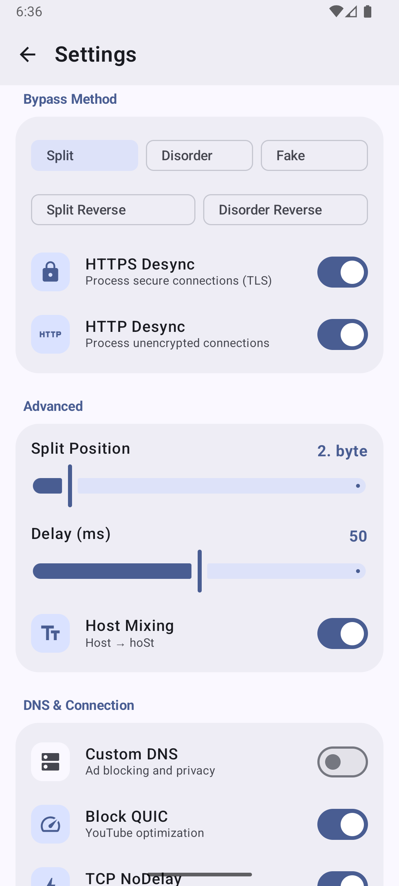
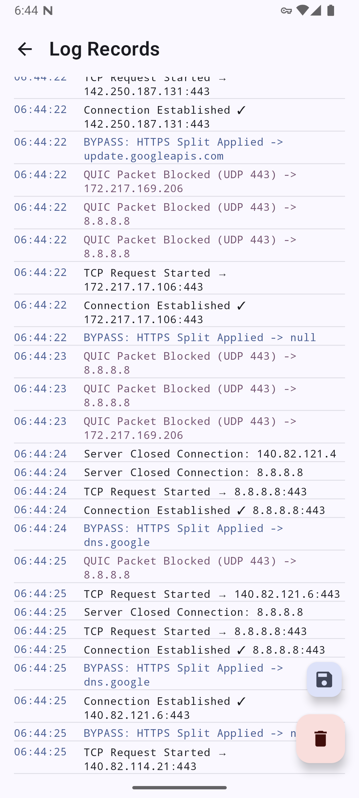
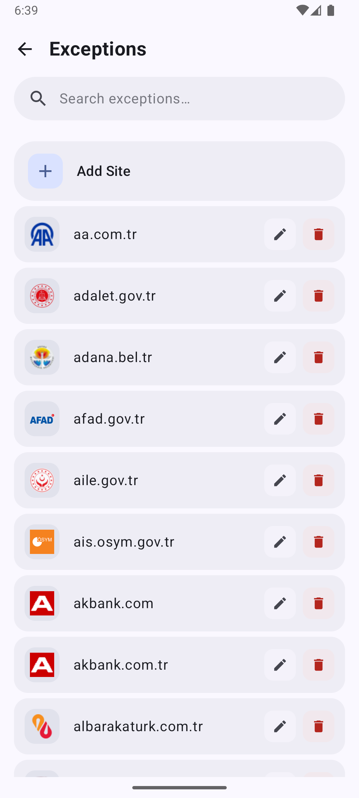

<p align="center">
  
</p>

<h1 align="center">Netrix</h1>

<p align="center">
  <b>DPI Bypass Tool for Android</b>
</p>

<p align="center">
  
  
  
  
</p>

<p align="center">
  Netrix bypasses Deep Packet Inspection (DPI) systems by fragmenting and manipulating TCP packets to circumvent SNI-based filtering.
</p>

---

## Screenshots

<p align="center">
  
  
  
  
</p>

---

## DPI Bypass Techniques

Netrix implements packet manipulation techniques targeting the TLS ClientHello SNI field. By fragmenting packets at specific positions, DPI systems fail to reconstruct and analyze the Server Name Indication.

### Methods

| Method | Description |
|--------|-------------|
| **Split** | Fragments TLS ClientHello at configurable byte position (default: 2 bytes). SNI field spans multiple TCP segments. |
| **Split Reverse** | Sends fragments in reverse order—second fragment first, then first. Based on GoodbyeDPI's `--reverse-frag`. |
| **Disorder** | Breaks packet into N chunks (configurable). Each chunk sent with optional inter-packet delay. |
| **Disorder Reverse** | Sends N chunks in reverse order (last to first). |
| **Fake** | Sends decoy HTTP packet before real data, then applies Split. Confuses stateful DPI. |

### Packet Flow

```
TLS ClientHello
┌────────────────────────────────────────────────┐
│ [Header] [SNI: blocked.com] [Extensions...]    │
└────────────────────────────────────────────────┘
                      │
                      ▼
            ┌─────────────────┐
            │  DPI Bypass     │
            │  • Parse SNI    │
            │  • Check WL     │
            │  • Fragment     │
            └─────────────────┘
                      │
      ┌───────────────┼───────────────┐
      ▼               ▼               ▼
 ┌─────────┐    ┌─────────┐    ┌─────────┐
 │ Split   │    │Disorder │    │  Fake   │
 │ [A][B]  │    │[1]..[N] │    │[F]+[A,B]│
 └─────────┘    └─────────┘    └─────────┘
```

### Key Parameters

| Parameter | Default | Description |
|-----------|---------|-------------|
| `firstPacketSize` | 2 | Split position in bytes |
| `splitCount` | 4 | Number of fragments for Disorder |
| `splitDelay` | 50ms | Inter-fragment delay |
| `fakeHex` | `GET / HTTP/1.0\r\n\r\n` | Fake packet payload |

---

## Features

### Network
- **VPN Mode** — VpnService-based interception (no root)
- **Root Mode** — NFQUEUE kernel-level packet handling
- **HTTP/HTTPS Desync** — Independent toggle for each protocol
- **Custom DNS** — AdGuard, Cloudflare, Control D support
- **QUIC Blocking** — Forces TCP for services like YouTube
- **TCP NoDelay** — Disables Nagle's algorithm
- **Domain Whitelist** — Configurable bypass exceptions

### Application
- **Real-time Logs** — Connection and bypass activity
- **Quick Settings Tile** — One-tap toggle
- **6 Themes** — System, AMOLED, Ocean, Forest, Sunset, Lavender
- **Localization** — English, Turkish

---

## Architecture

### Tech Stack

| Component | Technology |
|-----------|------------|
| Language | Kotlin 2.0 |
| UI | Jetpack Compose |
| Design | Material Design 3 |
| Native | C (NFQUEUE daemon) |
| Build | Gradle 8.x + CMake 3.22 |
| NDK | 28.2 |
| Min SDK | 24 (Android 7.0) |
| Target SDK | 35 (Android 15) |

### Project Structure

```
app/src/main/
├── kotlin/com/enki/netrix/
│   ├── vpn/
│   │   ├── BypassVpnService.kt    # VpnService implementation
│   │   ├── TcpConnection.kt       # TCP session management
│   │   ├── UdpConnection.kt       # UDP/DNS handling
│   │   ├── DpiBypass.kt           # Bypass algorithms
│   │   ├── Packet.kt              # IP/TCP packet parser
│   │   └── PacketBuilder.kt       # Packet construction
│   ├── native/
│   │   ├── NfqueueService.kt      # Root mode service
│   │   ├── DaemonController.kt    # Daemon IPC
│   │   └── RootHelper.kt          # su command wrapper
│   ├── data/
│   │   ├── DpiSettings.kt         # Configuration model
│   │   └── SettingsRepository.kt  # SharedPreferences
│   └── ui/screens/                # Compose screens
└── cpp/
    ├── nfqueue_handler.c          # libnetfilter_queue
    ├── dpi_bypass.c               # Native bypass impl
    └── CMakeLists.txt
```

### Data Flow

```
┌─────────┐    ┌───────────┐    ┌─────────────┐
│   App   │───▶│  TUN i/f  │───▶│   Netrix    │
└─────────┘    └───────────┘    └─────────────┘
                                      │
                    ┌─────────────────┴─────────────────┐
                    ▼                                   ▼
             ┌────────────┐                      ┌────────────┐
             │    TCP     │                      │    UDP     │
             │ DpiBypass  │                      │ DNS Proxy  │
             │ SNI Parse  │                      │ QUIC Block │
             └────────────┘                      └────────────┘
                    │                                   │
                    └─────────────┬─────────────────────┘
                                  ▼
                          ┌──────────────────────┐
                          │    Real Server       │
                          │  (example.com:443)   │
                          └──────────────────────┘
```

---

## Installation

### Requirements
- Android 7.0+ (API 24)
- VPN permission
- Root (optional, for NFQUEUE mode)

### Download
See [Releases](../../releases) for APK downloads.

---

## Configuration

### Recommended Settings

| Setting | Recommended Value | Description |
|---------|-------------------|-------------|
| Bypass Method | Split | Best balance of speed and effectiveness |
| Split Position | 2 bytes | Works for most DPI systems |
| Delay | 50ms | Increase if bypass fails |
| QUIC Block | Enabled | Improves YouTube performance |
| Custom DNS | Enabled (AdGuard) | Ad blocking + privacy |

### Root Mode

NFQUEUE mode provides kernel-level packet manipulation:
- Lower latency than VPN mode
- System-wide coverage
- Requires: Magisk + permissive SELinux or custom policy

---

## Building

```bash
git clone https://github.com/user/netrix.git
cd netrix

# Debug build
./gradlew assembleDebug

# Release build
./gradlew assembleRelease

# Native only
./gradlew externalNativeBuildDebug
```


---

## License

This project is licensed under the GNU General Public License v3.0 — see [LICENSE](LICENSE) for details.
